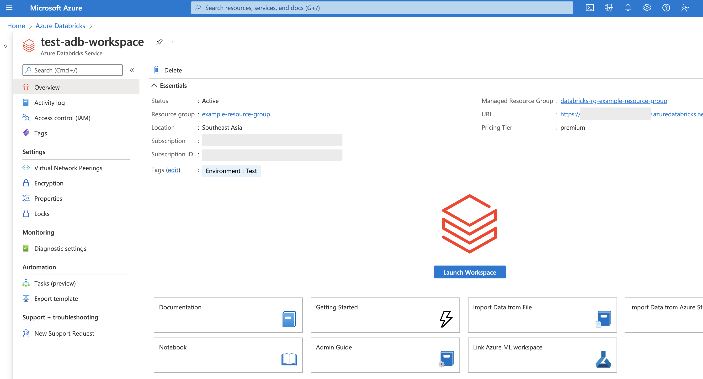
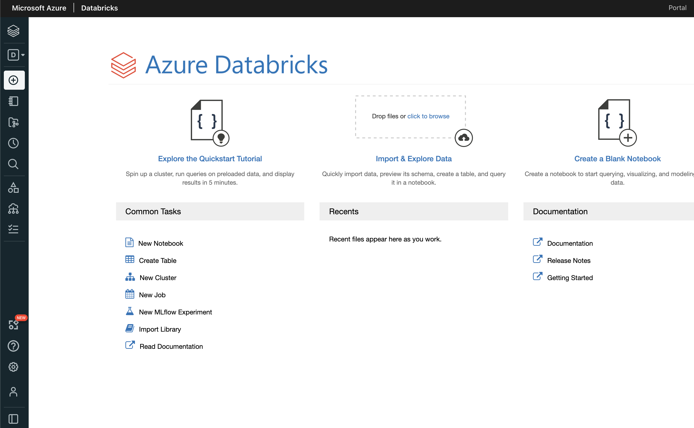
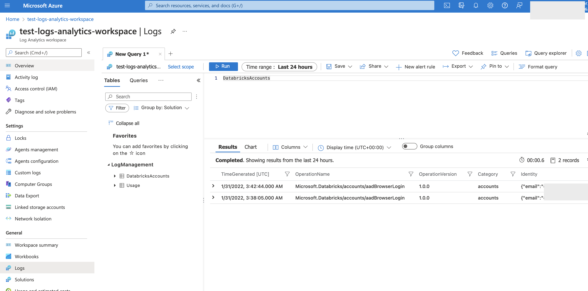
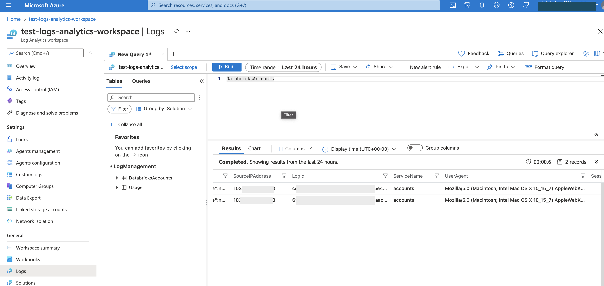
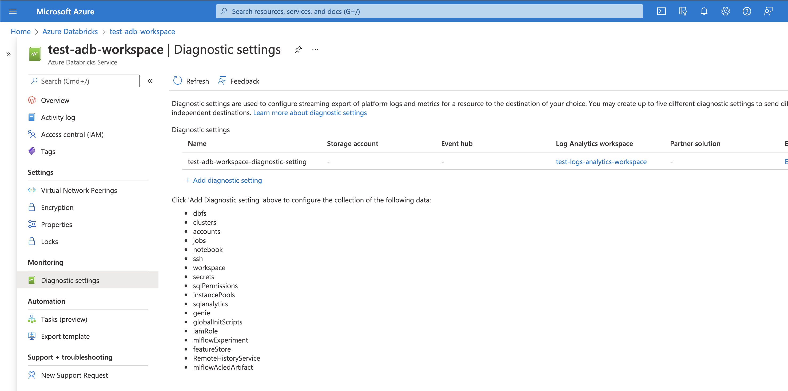
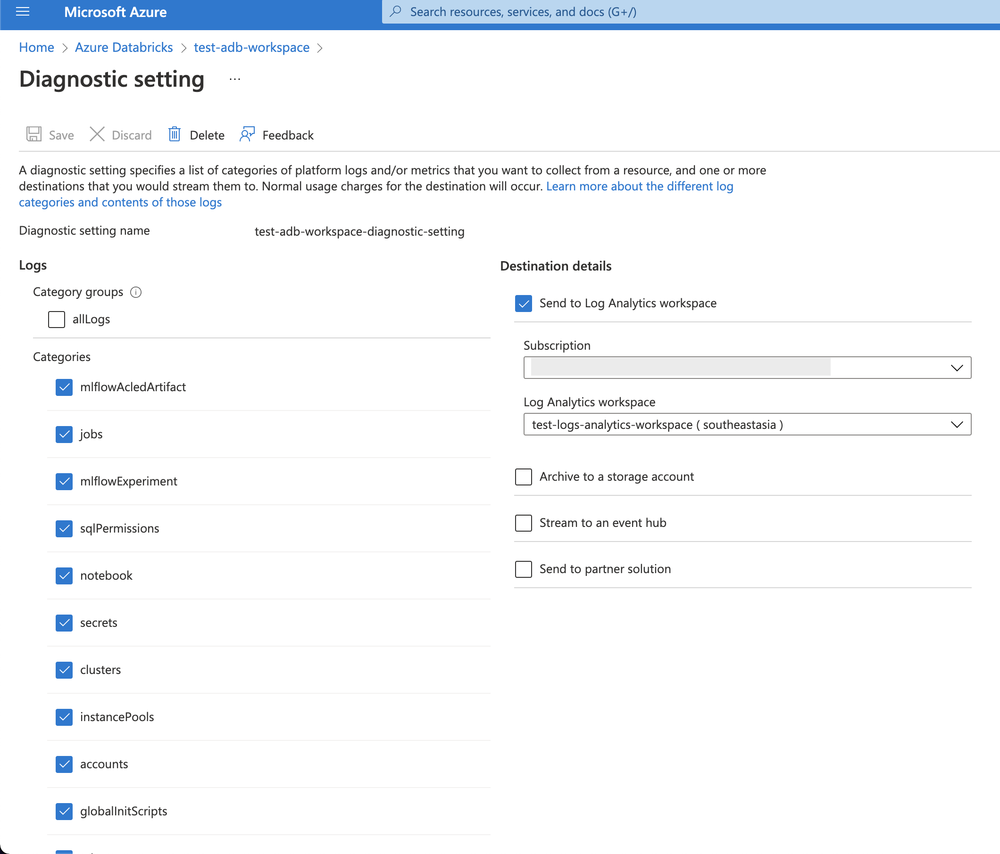

# Azure Databricks with Terraform

This is an example repository to provision an Azure Databricks workspace using Terraform.

There are two Terraform providers for Databricks from Azure and Databricks Labs. For this example, the resource provider from Azure was used.

## Audit logs
Azure Databricks provides end-to-end diagnostic logs of activities performed by Azure Databricks users for Premium workspaces.

This can be useful to monitor the Azure Databricks usage patterns in Log Analytics or create Azure alerts on suspicious events (e.g. multiple login attempts from blacklisted IP addresses).

This can be set up manually from the Azure Portal as shown below, but we can also provision the Log Analytics Workspace and Diagnostic Setting via Terraform. Please refer to the source code for details.

